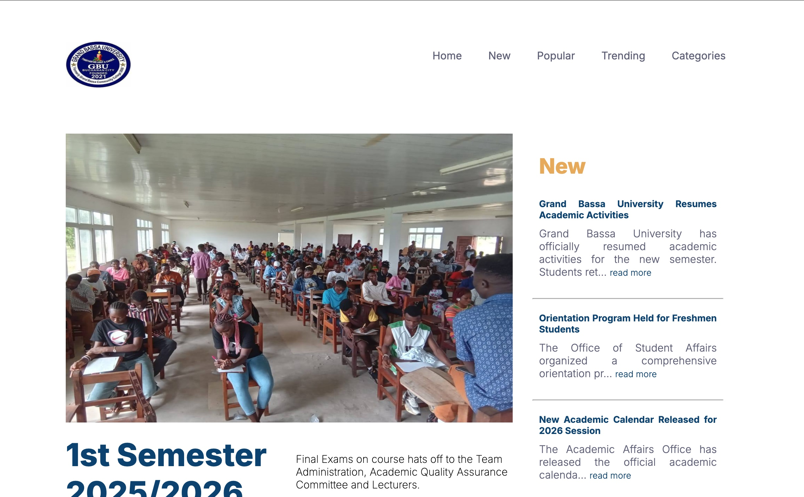

## Table of contents

- [Overview](#overview)
- [My process](#my-process)
  - [Built with](#built-with)
  - [What I learned](#what-i-learned)
- [Author](#author)


**Note: Delete this note and update the table of contents based on what sections you keep.**

## Overview

### ########## University News Website ######### ###########

- A dynamic university news website built with Node.js, Express, and EJS. The platform displays campus news, announcements, and events using data stored in JSON format. It features server-side rendering, reusable EJS partials, form handling, and static asset management for images and styles.

- This project demonstrates practical full-stack development skills,  including Express routing, dynamic content rendering, and structured project organization.

### Screenshot



## My process
   - Currently learning Full-Stack Developer
### Built with

- Semantic HTML5 markup
- CSS custom properties
- CSS Grid
- Mobile-first workflow
- [jQuery](https://jquery.com/) - JS library
- Express
- Node
- ejs


### What I learned

- Using express route, passing locals to ejs templating 
- rendering the news json data to user using ejs 


```js
 
app.get("/news", (req, res) => {
     res.render("index.ejs", {
        data: post,
        highOne: post[0],
        highTwo: post[1],
        highThree: post[3],

       highOnePost: post[0].post.slice(0, 100) + '...',
       highTwoPost: post[1].post.slice(0, 70) + '...',
         highThreePost: post[3].post.slice(0, 70) + '...',
       
          

     })
})

app.get("/index", (req, res) => {
    res.redirect("/")
})
```

```ejs
     <% data.forEach(post => { %>
    <section class="moreNews">

       

        <h2 class="author" id="moreNews" >
          Author:  <%= post.author %> 

            <small class="postid"> Post ID:
                <%= post.id %>
            </small>
           
        </h2> 
       
        
        
        <p class="post-title">
           <em class="special-text">Title:</em> <%= post.title %>
        </p>

       
        <p class="post"> 
            <%= post.post %>
        
        </p>
        <p class="post-date slide-left">
            Posted On <%= post.date %>
        
        </p>

        <div class="post-img-block">
             " alt="<%= post.title %>" class="post-img slide-up" >
        </div>

        


        </section>
    <%}); %>

```

## Author

- Frontend Mentor - [Sayon-okai](https://www.frontendmentor.io/profile/Sayon-okai)
- GitHub - [Sayon-okai](https://github.com/Sayon-okai)


